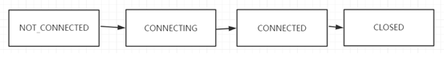

# zookeeper-sample
学习zookeeper的心路历程

### 1、 为什么要用zookeeper？

传统的服务带来的一系列问题，由此产生了分布式服务，但是分布式服务的出现也引发了一系列问题，比如服务的治理、监控、数据一致性、负载等等，这就产生了zookeeper

### 2、 zookeeper能做什么

分布式数据一致性的解决方案，分布式协调技术

数据的发布/订阅（配置中心:disconf）  、 负载均衡（dubbo利用了zookeeper机制实现负载均衡） 、命名服务、

master选举(kafka、hadoop、hbase)、分布式队列、分布式锁、ID生成器

### 3、 集群角色：Leader、Follower、Observer

.jpg)

### 4、 存储结构：

类似文件系统的存储方式，分为持久化节点和临时节点，又分为有序和无序。短暂的znode在创建的客户端与服务器端断开（无论是明确的断开还是故障断开）连接时，该znode都会被删除
临时节点不予许有子节点。

ZooKeeper不支持递归的删除操作，因此在删除父节点之前必须先删除子节点

.jpg)

### 5、 CAP理论

在理论计算机科学中，CAP定理（CAP theorem），又被称作布鲁尔定理（Brewer’s theorem），它指出对于一个分布式计算系统来说，不可能同时满足以下三点：

* 一致性（Consistence) （等同于所有节点访问同一份最新的数据副本）
* 可用性（Availability）（每次请求都能获取到非错的响应——但是不保证获取的数据为最新数据）
* 分区容错性（Network partitioning）（以实际效果而言，分区相当于对通信的时限要求。系统如果不能在时限内达成数据一致性，就意味着发生了分区的情况，必须就当前操作在C和A之间做出选择。）

根据定理，分布式系统只能满足三项中的两项而不可能满足全部三项。理解CAP理论的最简单方式是想象两个节点分处分区两侧。允许至少一个节点更新状态会导致数据不一致，即丧失了C性质。如果为了保证数据一致性，将分区一侧的节点设置为不可用，那么又丧失了A性质。除非两个节点可以互相通信，才能既保证C又保证A，这又会导致丧失P性质。

对于zookeeper来说，它实现了A可用性、P分区容错性、C中的写入强一致性，丧失的是C中的读取一致性。**Zookeeper并不保证读取的是最新数据**

但这并不影响zk分布式事务操作的原子性：要么全部follower+Leader都成功，要么都失败
有所丧失，才有所获得，没有十全十美。

### 6、Leader选举：
（https://www.cnblogs.com/ASPNET2008/p/6421571.html）

* 服务器ID

    比如有三台服务器，编号分别是1,2,3。
    编号越大在选择算法中的权重越大。
    
* 数据ID(版本ID)

    服务器中存放的最大数据ID.
    值越大说明数据越新，在选举算法中数据越新权重越大。
* 逻辑时钟

    或者叫投票的次数，同一轮投票过程中的逻辑时钟值是相同的。
    每投完一次票这个数据就会增加，然后与接收到的其它服务器返回的投票信息中的数值相比，
    根据不同的值做出不同的判断。
* 选举状态

    LOOKING，竞选状态。
    FOLLOWING，随从状态，同步leader状态，参与投票。
    OBSERVING，观察状态,同步leader状态，不参与投票。
    LEADING，领导者状态。

### 7、ZAB协议  
https://blog.csdn.net/junchenbb0430/article/details/77583955 、 https://blog.csdn.net/liuhaiabc/article/details/70771322

* ZAB协议是专门为zookeeper实现分布式协调功能而设计。zookeeper主要是根据ZAB协议是实现分布式系统数据一致性。
* zookeeper根据ZAB协议建立了主备模型完成zookeeper集群中数据的同步。这里所说的主备系统架构模型是指，在zookeeper集群中，只有一台leader负责处理外部客户端的事物请求(或写操作)，然后leader服务器将客户端的写操作数据同步到所有的follower节点中。 

**1）消息广播模式**

在zookeeper集群中数据副本的传递策略就是采用消息广播模式。zookeeper中数据副本的同步方式与二阶段提交相似但是却又不同。二阶段提交的要求协调者必须等到所有的参与者全部反馈ACK确认消息后，再发送commit消息。要求所有的参与者要么全部成功要么全部失败。二阶段提交会产生严重阻塞问题。

ZAB协议中Leader等待follower的ACK反馈是指”只要半数以上的follower成功反馈即可，不需要收到全部follower反馈”

_ps：这里客户端的事务请求（增删改）可能是到follower，但是follower会转给leader_

**2）崩溃恢复**

当leader出现问题，zab协议进入崩溃恢复模式，并且选举出新的leader。当新的leader选举出来以后，如果集群中已经有过半机器完成了leader服务器的状态同（数据同步），退出崩溃恢复，进入消息广播模式

当新的机器加入到集群中的时候，如果已经存在leader服务器，那么新加入的服务器就会自觉进入数据恢复模式，找到leader进行数据同步

### 8、会话

客户端与zk集群（中的一台）采用socket长连接建立会话，会话有个SessionID；

连接中，客户端会定时向服务端发起心跳检测保持连接。

### 9、ACL

传统的文件系统中，ACL分为两个维度，一个是属组，一个是权限，子目录/文件默认继承父目录的ACL。而在Zookeeper中，node的ACL是没有继承关系的，是独立控制的。Zookeeper的ACL，可以从三个维度来理解：一是scheme; 二是user; 三是permission，通常表示为scheme:id:permissions, 下面从这三个方面分别来介绍

### 10、为什么集群建议是单数（可以双数）？(不包括observer)

因为投票只需要半数以上通过、对节点的修改需要半数成功，双数的话会浪费一台机器

### 11、zookeeper客户端：

1）原生：垃圾，不支持超时重连、不支持递归创建节点

2）zkClient：一个大佬在GitHub写的开源代码，封装了下原生api，但是还是垃圾

3）curator：apache开源，fluent编码风格爽得不行，提供分布式锁解决方案，dubbo-spring-boot-starter的zookeeper客户端就用的这个

### 12、配置管理

### 13、分布式锁产生的原因：

在传统的单机环境中，多线程对共享变量的访问可以Lock或者Synchronized进行互斥控制；但是随着业务的发展，系统被演化为分布式集群，锁的控制范围从线程级别变为进程级别；传统java-api已无法满足；

这个时候需要分布式锁来解决跨JVM的共享资源访问问题场景，比如：在分布式系统环境下，一个方法在同一时间只能被一个机器的一个线程执行；（router发每日订单邮件） 。

### 14、分布式锁实现方式：

1）基于数据库唯一索引实现分布式锁； 

2）基于缓存（Redis等）实现分布式锁； （router发邮件用的这个）

3）基于Zookeeper实现分布式锁；（创建临时顺序节点，监听比自己小的节点，到自己了就获得锁）

### 15、zookeeper实现master选举（router发邮件可用这个）

为了保证服务机器的高可用，我们多采用master-salve模式（主从模式），一台机器挂了，另一台顶替上去，传统的解决方法是备用机不停的ping主机，如果主机挂了备用机将行使主节点职责。但是这样有个隐患：主节点没挂，但是由于网络原因备节点没有收到ack，这样就会出现两个master；

zookeeper解决了这个问题：通过争抢机制来保证只有一个master存在，所有服务启动后都会去zk创建一个临时同名节点，最先创建的就是master，没抢到的就开始监听这个节点的删除事件；利用临时节点失去连接（master宕机）就会被删除的特性，备用机收到节点删除事件便重新争抢创建同名节点，先到先得；

### 16、watcher原理

zookeeper提供了分布式数据发布/订阅,zookeeper允许客户端向服务器注册一个watcher监听。当服务器端的节点触发指定事件的时候，会触发watcher。服务端会向客户端发送一个事件通知；

watcher的通知是一次性，一旦触发一次通知后，该watcher就失效

客户端通过watcherManager来管理各种watchers（应该每个都是一个线程），服务端一个节点发生变化后，会通过队列的非阻塞的模式向客户端发送event消息（Socket传输）；

### 17、zookeeper数据存储

zookeeper运行时的数据都是在内存里操作的（不是在硬盘上，不然哪来那么高的效率）

会定时把数据快照存储在磁盘（DataDir）上

快照： 存储某一个时刻全量的内存数据内容

DataLogDir 存储事务日志

### 18、统一命名服务（Name Service）

分布式应用中，通常需要有一套完整的命名规则，既能够产生唯一的名称又便于人识别和记住，通常情况下用树形的名称结构是一个理想的选择，树形的名称结构是一个有层次的目录结构，既对人友好又不会重复。说到这里你可能想到了 JNDI，没错 Zookeeper 的 Name Service 与 JNDI 能够完成的功能是差不多的，它们都是将有层次的目录结构关联到一定资源上，但是 Zookeeper 的 Name Service 更加是广泛意义上的关联，也许你并不需要将名称关联到特定资源上，你可能只需要一个不会重复名称，就像数据库中产生一个唯一的数字主键一样。

